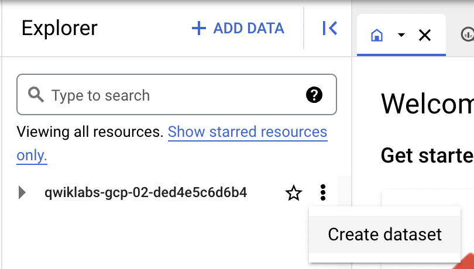
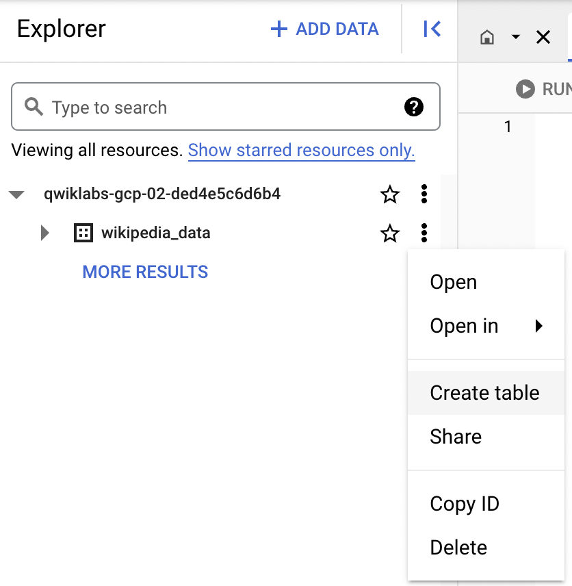
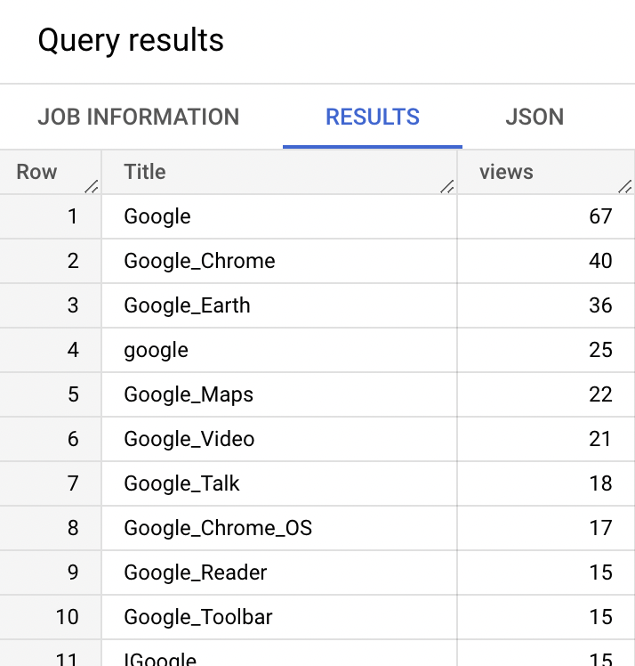
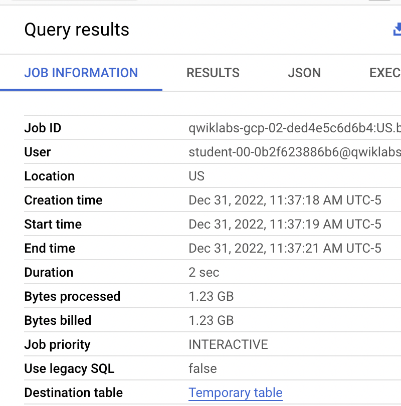
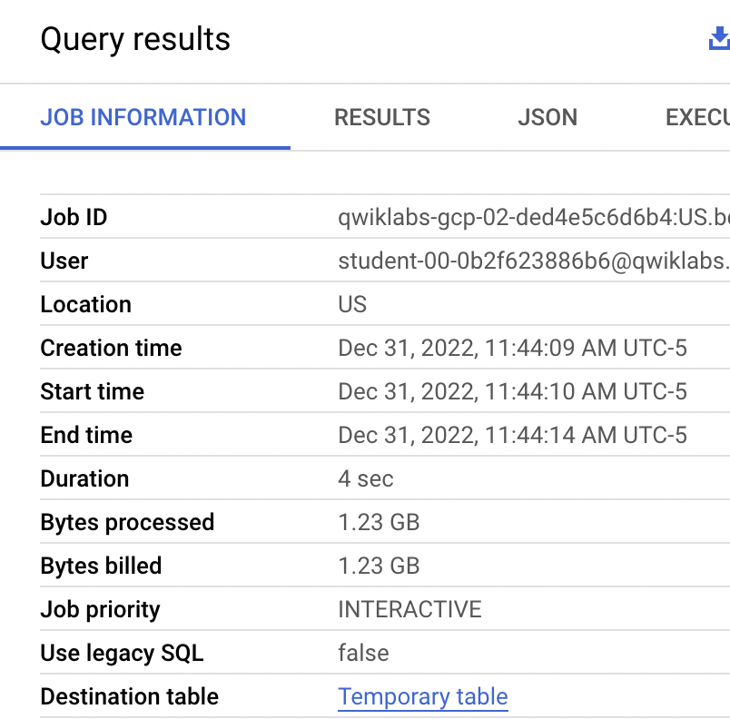
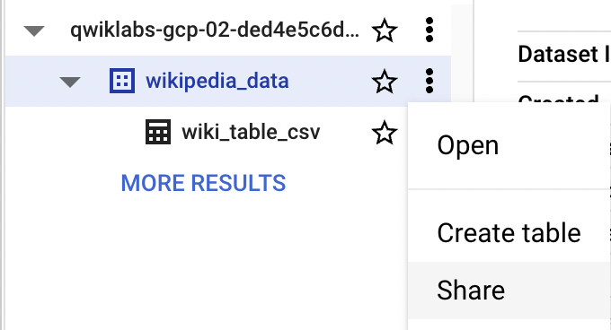
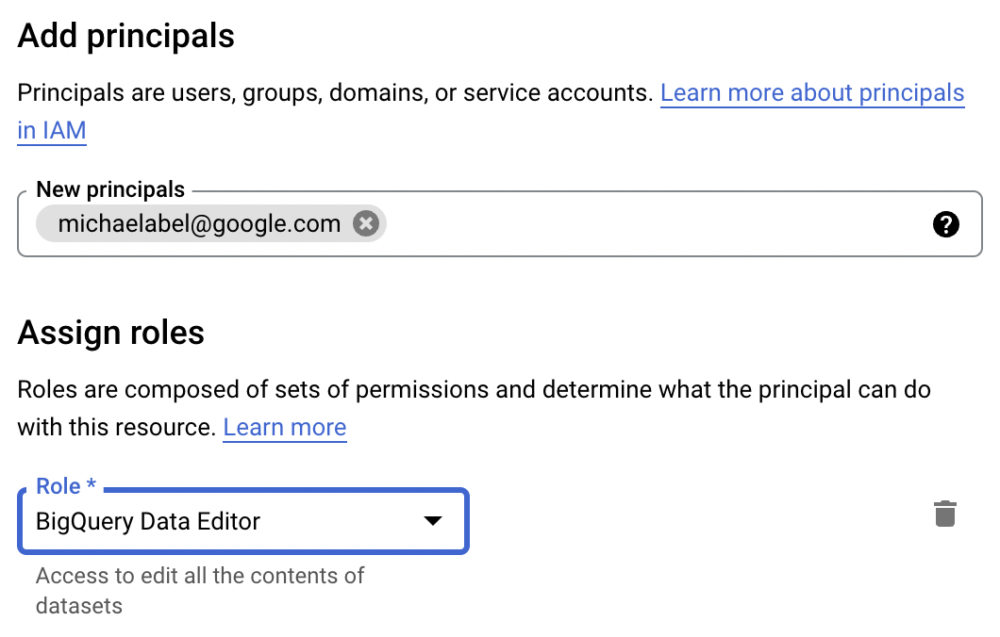
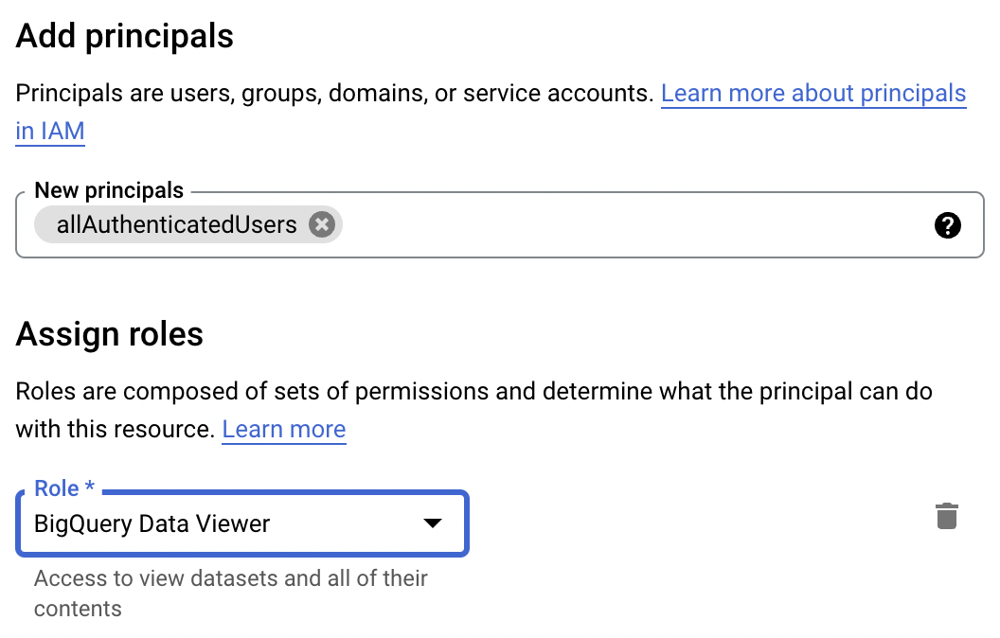
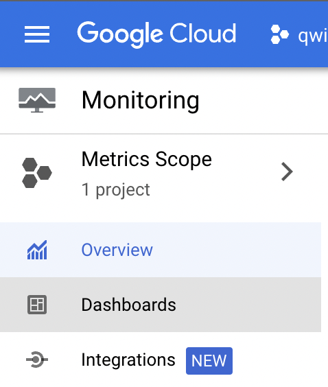

# Provisioning and Managing Resources in BigQuery

## Overview

In this lab, you will use the Google Cloud Console and the CLI to create BigQuery Datasets and tables. You will also control access to and share data and momitor your BigQuery usage. 

## Objectives

In this lab, you learn how to:
* Create datasets
* Create native and external tables
* Control access to and share data
* Monitor resource utilization 


## Setup and Requirements

![[/fragments/start-qwiklab]]


![[/fragments/cloudshell]]


## Task 1. Create datasets

1. In the Google Cloud Console, from the Navigation menu () select __BigQuery__. 


2. In the BigQuery UI Explorer pane, click on the Action menu next to your Project ID, and select __Create Dataset__.




3. In the resulting dialog, set the Dataset ID to `wikipedia_data`, and set the Data location to __US (multiple regions in United States)__. Then, click the __Create Dataset__ button. 


## Task 2. Create native and external tables

1. In the Explorer pane, click on the Action menu next to `wikipedia_data`, and select __Create Table__.



2. In the Create Table dialog, set the Source to __Google Cloud Storage__. Then, set the file pattern to `bigquery-demo-bucket/wikipedia-data/csv/Wiki1B-*.csv`

__Note:__ The astericks (*) in the file pattern. There is about a Gigibyte of data being imported from a number of CSV files. 

3. Confirm the file format was changed to CSV. In the Destination section, confirm the Dataset is set to `wikipedia_data`, and set the Table name to `wiki_table_csv`

4. In the Schema section, check the __Auto detect__ check box. 

5. Expand the __Advanced options__ section, and set the __Header rows to skip__ property to 1. Finally, click the __Create Table__ button. 

6. In the Exporer pane, select the Action menu next to the `wiki_table_csv` table and select __Query__. 

7. In the Query editor, paste the following query and run it. 

```
SELECT
  Title, COUNT(views) AS views
FROM
  wikipedia_data.wiki_table_csv
WHERE
  CONTAINS_SUBSTR(title, 'GOOGLE')
GROUP BY
  Title
ORDER BY
  views DESC
LIMIT
  100;
```

8. Examine the Query Results.



9. Click on __Job Information__ and examine it as well. 



### You will now create an external table. 

8. As before, click the Action menu next to the `wikipedia_data` dataset, and click __Create table__. 

9. Set the Source to __Google Cloud Storage__, and set the file pattern to `bigquery-demo-bucket/wikipedia-data/parquet/Wiki1B-*`. Also, set the file format to __Parquet__.

__Note:__ This is the same data that you imported earlier, but this data is in Parquet format. This is a columnar format similar to BigQuery's native format and also Redshift's native format. 

10. In the Destination section, confirm the Dataset is set to `wikipedia_data`, and set the Table name to `wiki_external_table_parquet`, and set the Table type property to __External table__. 

__Note:__ External tables are not imported into BigQuery Storage. The data stays in Cloud Storage, and only the Schema is added to BigQuery. The table can be queried in the same way though. 

11. As before, check the __Auto detect__ check box in the schema section. Then, click the __Create Table__ button. 

12. Run the same query as before, but using the external table. Compare the Query Results and Job Information from each one. You should find that the query using the native BigQuery table ran faster than the one that used the external table.   

```
SELECT
  Title, COUNT(views) AS views
FROM
  wikipedia_data.wiki_external_table_parquet
WHERE
  CONTAINS_SUBSTR(title, 'GOOGLE')
GROUP BY
  Title
ORDER BY
  views DESC
LIMIT
  100;
```



## Task 3. Control access to and Share data

1. In the Explorer pane, click on the Action menu next to `wikipedia_data`, and select __Share__.




2. You will make our colleague Mike a BigQuery Data Editor. Click the __Add Principal__ button. Enter the email `michaelabel@google.com`, and assign to him the role __BigQuery Data Editor__. Then, click the __Save__ button. 




__Note:__ You have given Mike permissions to edit data in the dataset. You will now give everyone permissions to query the Wikipedia data. 

3. As you just did, click on the Action menu next to `wikipedia_data`, and select __Share__.  Click on the __Add Principal__ button. This time set the new principal to the key word `allAuthenticatedUsers`, and assign to that principal the __BigQuery Data Viewer__ role. When prompted, click __Allow Public Access__




## Task 4. Monitor resource utilization 

1. In the Google Cloud Console, from the Navigation menu () scroll down to the Operations section, and select __Monitoring__. 

2. From the left-hand pane of the Monitoring UI, select Dashboards. 




3. Click on the __BigQuery__ dashboard from the All Dashboards table. 

4. There is not much data to see because you just started using this project, but there should be some. Note under Project metrics, you have charts for Queries in Flight, Query Times, and Slot Utilization. 


## Task 5. Create Resources with the CLI

1. On the Google Cloud Console title bar, click __Activate Cloud Shell__ (). If prompted, click __Continue__.

2. Enter the following command; you should see the dataset you created earlier. 

```
bq ls
```

3. Enter the following command; you should see the tables in your dataset. 

```
bq ls wikipedia_data
```

4. Create a new dataset with the following command.

```
bq mk --location=US bikes_database
```

5. Now add a table to the dataset you just created. The table is named `regions`, the data is in a CSV file in Google Cloud Storage. You will use the --autodetect parameter, to automatically detect the table schema. 

```
bq load --autodetect bikes_database.regions gs://bigquery-demo-bucket/bikes-database/regions.csv
```

6. There are two more files in the same bucket: `stations.csv` and `trips.csv`. Use the same command as above, but create two more tables: `stations` and `trips`, using those two files. 


```
bq load --autodetect bikes_database.stations gs://bigquery-demo-bucket/bikes-database/stations.csv

bq load --autodetect bikes_database.trips gs://bigquery-demo-bucket/bikes-database/trips.csv
```

7. See if the tables were created using the following command.

```
bq ls bikes_database
```

8. Use the following command to see some data from the stations table. 

```
bq head bikes_database.stations
```


8. Now the trips table. 

```
bq head bikes_database.trips
```

9. Now run a query.

```
bq query """
SELECT
  s.name,
  COUNT(t.trip_id) AS trips
FROM
  bikes_database.stations s
JOIN
  bikes_database.trips t
ON
  s.name = t.start_station_name
GROUP BY
  s.name
ORDER BY
  trips DESC;
"""
```

10. In Cloud Shell type `exit`. Then, refresh the BigQuery UI. In the Explorer pane, expand your project to find your newly added dataset and tables. 

11. Explore the UI, and try experimenting with some queries to get familiar with it. 


### **Congratulations!** You have used the Google Cloud Console and the CLI to create BigQuery Datasets and tables. You also controlled access to and shared data and momitored your BigQuery usage. 


![[/fragments/endqwiklab]]

![[/fragments/copyright]]

