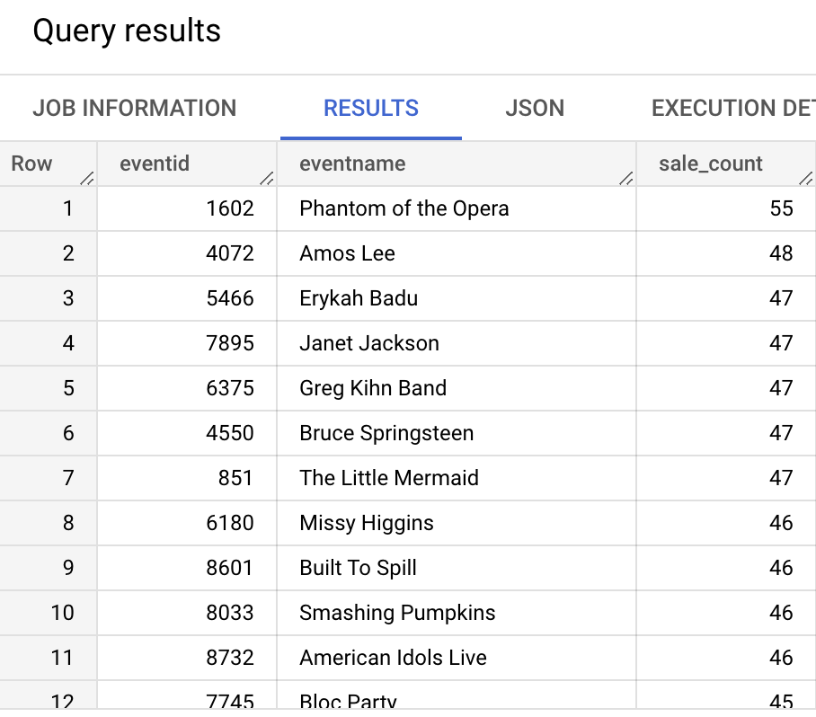

# Schema Migration from Amazon Redshift to BigQuery

## Overview

In this lab, you define schemas in BigQuery, create partitioned and clustered tables, and query nested and repeated fields.

## Objectives

In this lab, you learn how to:
* Define schemas in BigQuery
* Create partitioned and clustered tables
* Query nested and repeated fields


## Setup and Requirements

![[/fragments/start-qwiklab]]


![[/fragments/cloudshell]]


## Task 1. Define schemas in BigQuery

1. In the Google Cloud console, from the Navigation menu (), select __BigQuery__. 

2. In the SQL Workspace toolbar, click the Editor icon to open the SQL code editor.


3. Paste the following SQL code and click the __Run__ button to create a dataset named `ticket_sales`

```
CREATE SCHEMA IF NOT EXISTS ticket_sales OPTIONS( 
  location="us");
```

4. When the query completes, in the __Results__ pane, click the __Go to Dataset__ button. Also, in the Explorer pane, expand your project to verify that the dataset was created. 


5. Return to the SQL code editor and replace the existing code with the following CREATE TABLE statement, then click the __Run__ button. This code creates a table called `categories` in the dataset you just created. 

```
CREATE TABLE ticket_sales.categories(
  catid INT64 NOT NULL,
  catgroup STRING,
  catname STRING,
  catdesc STRING);
```

6. When the query completes, go to the __Results__ pane and click the __Go to Table__ button. 

7. There is no data in the table. Again, in the SQL code editor, run the following code to load data into the `categories` table from a CSV file in Cloud Storage. 

```
LOAD DATA INTO ticket_sales.categories
FROM FILES (
  format = 'CSV', 
  field_delimiter = ',',
  max_bad_records = 10,
  uris = ['gs://bigquery-demo-bucket/ticket-sales/categories.csv']);
```

8. Run the following SELECT statement to confirm the data was loaded into the table. 

```
SELECT * FROM ticket_sales.categories;
```

9. At this point, you have seen how to use SQL to create a dataset and a table, and load data into it. Now, you create a number of other tables for the Ticket Sales example (_this is really just more of the same_). <div>Quickly read through the code below, and then run it to create the rest of the tables.</div>

```
CREATE TABLE ticket_sales.dates(
  dateid INT64 NOT NULL,
  caldate DATE NOT NULL,
  day STRING NOT NULL,
  week INT64 NOT NULL,
  month STRING NOT NULL,
  qtr INT64 NOT NULL,
  year INT64 NOT NULL,
  holiday BOOL);

CREATE TABLE ticket_sales.events(
  eventid INT64 NOT NULL,
  venueid INT64 NOT NULL,
  catid INT64 NOT NULL,
  dateid INT64 NOT NULL,
  eventname STRING,
  starttime TIMESTAMP);

  CREATE TABLE ticket_sales.listings(
  listid INT64 NOT NULL,
  sellerid INT64 NOT NULL,
  eventid INT64 NOT NULL,
  dateid INT64 NOT NULL,
  numtickets INT64 NOT NULL,
  priceperticket FLOAT64,
  totalprice FLOAT64,
  listtime TIMESTAMP);

CREATE TABLE ticket_sales.sales(
  salesid INT64 NOT NULL,
  listid INT64 NOT NULL,
  sellerid INT64 NOT NULL,
  buyerid INT64 NOT NULL,
  eventid INT64 NOT NULL,
  dateid INT64 NOT NULL,
  qtysold INT64 NOT NULL,
  pricepaid FLOAT64,
  commission FLOAT64,
  saletime STRING);

CREATE TABLE ticket_sales.users(
  userid INT64 NOT NULL,
  username STRING,
  firstname STRING,
  lastname STRING,
  city STRING,
  state STRING,
  email STRING,
  phone STRING,
  likesports BOOL,
  liketheatre BOOL,
  likeconcerts BOOL,
  likejazz BOOL,
  likeclassical BOOL,
  likeopera BOOL,
  likerock BOOL,
  likevegas BOOL,
  likebroadway BOOL,
  likemusicals BOOL);

  CREATE TABLE ticket_sales.venues(
  venueid INT64  NOT NULL,
  venuename STRING,
  venuecity STRING,
  venuestate STRING,
  venueseats INT64
);
```

10. When the command completes, take a look at the Explorer pane. The following tables should have been created. 


11. As before, you must load the data into the tables. Run the following SQL statements to do that. _This is just like the command you ran earlier, but for the other tables._ 

```
LOAD DATA INTO ticket_sales.dates
FROM FILES (
  format = 'CSV', 
  field_delimiter = ',',
  max_bad_records = 10,
  uris = ['gs://bigquery-demo-bucket/ticket-sales/dates.csv']);

LOAD DATA INTO ticket_sales.events
FROM FILES (
  format = 'CSV', 
  field_delimiter = ',',
  max_bad_records = 10,
  uris = ['gs://bigquery-demo-bucket/ticket-sales/events.csv']);

LOAD DATA INTO ticket_sales.listings
FROM FILES (
  format = 'CSV', 
  field_delimiter = ',',
  max_bad_records = 10,
  uris = ['gs://bigquery-demo-bucket/ticket-sales/listings.csv']);

LOAD DATA INTO ticket_sales.sales
FROM FILES (
  format = 'CSV', 
  field_delimiter = ',',
  max_bad_records = 10,
  uris = ['gs://bigquery-demo-bucket/ticket-sales/sales.csv']);

LOAD DATA INTO ticket_sales.users
FROM FILES (
  format = 'CSV', 
  field_delimiter = ',',
  max_bad_records = 10,
  uris = ['gs://bigquery-demo-bucket/ticket-sales/users.csv']);

LOAD DATA INTO ticket_sales.venues
FROM FILES (
  format = 'CSV', 
  field_delimiter = ',',
  max_bad_records = 10,
  uris = ['gs://bigquery-demo-bucket/ticket-sales/venues.csv']);
```

12. When the code completes, review the results pane to ensure all the LOAD statements worked as expected. 


13. Run the following query as a test. This shows events by category. 

```
SELECT
  c.catid,
  c.catname,
  e.eventname,
  CAST(e.starttime as DATETIME) as starttime
FROM
  ticket_sales.categories c
JOIN
  ticket_sales.events e
ON
  c.catid = e.catid
```


## Task 2. Create partitioned tables

1. In the query editor, paste the following code, but __do not__ click Run. 

```
SELECT * FROM ticket_sales.sales;
```

2. Notice the number of bytes that will be processed when the query is run. 


3. Now, paste the following query. Notice the number of bytes processed is the same even though the query is only asking for sales from a specific date. 

```
SELECT * FROM ticket_sales.sales WHERE saletime = '12/14/2008 09:13:17';
```

4. You can use partitioning to organize tables so you query less data when filtering it. Run the following code to create a new sales table that is partitioned by the sale date. 

```
CREATE OR REPLACE TABLE
  ticket_sales.sales_partitioned_by_date
PARTITION BY
  DATETIME_TRUNC(saletime, DAY)
AS (
  SELECT
    * except (saletime), 
    PARSE_DATETIME( "%m/%d/%Y %H:%M:%S", saletime) as saletime
  FROM
    ticket_sales.sales );
```

5. Paste in the following SELECT statement. As before __do not__ click the Run button. Examine how many bytes will be processed by the query. 

```
SELECT * FROM ticket_sales.sales_partitioned_by_date;
```

6. Now, paste the following query. Notice significantly less data will be processed when the query is run. Less data processed means less cost and faster queries. 

```
SELECT * FROM ticket_sales.sales_partitioned_by_date WHERE DATE(saletime) = '2008-10-18';
```


## Task 3. Create clustered tables

A clustered table is sorted by 1 to 4 columns. When you have a lot of data, clustering will make joins, group-bys, searches, and sorting faster. 

1. Run the following query. This query uses one of Google's public datasets that contains a lot of data (_in this case, 10 billion rows_). The query counts views by language in a table of Wikipedia data. 

```
SELECT
  LANGUAGE,
  COUNT(views) AS views
FROM
  `bigquery-samples.wikipedia_benchmark.Wiki10B`
GROUP BY
  LANGUAGE
ORDER BY
  views DESC;
```

2. After the table runs, in the __Results__ pane, examine its execution details. Note the number of bytes shuffled. 


3. Now, you re-create the same table, but cluster on the language field. Run the following SQL command to create a new dataset in your project called `wiki_clustered`.

```
CREATE SCHEMA IF NOT EXISTS wiki_clustered OPTIONS( 
  location="us");
```

4. Create the clustered table using the following statement (_this command will take a minute or two to run_).

```
CREATE OR REPLACE TABLE
  wiki_clustered.Wiki10B_by_language
CLUSTER BY
  language
AS (
  SELECT
    * 
  FROM
    `bigquery-samples.wikipedia_benchmark.Wiki10B` );
```

5. Run the query below. It is the same as the earlier query, but runs against the clustered table. 

```
SELECT
  LANGUAGE,
  COUNT(views) AS views
FROM
  wiki_clustered.Wiki10B_by_language
GROUP BY
  LANGUAGE
ORDER BY
  views DESC;
```

6. As before, when the query completes, examine its execution details. Notice the number of bytes shuffled is significantly lower. Fewer bytes shuffled means faster execution time. 


## Task 3. Query nested and repeated Fields

1. Run the following query. <div>__Note:__ There is a one-to-many relationship between the events table and the sales table. When you run this query, you see a lot of repetition on the one side of the relationships. For every sale, the event is repeated. </div>

```
SELECT
  e.eventid,
  e.eventname,
  s.saletime,
  s.qtysold,
  s.pricepaid,
  s.commission
FROM
  ticket_sales.events e
JOIN
  ticket_sales.sales s
  on
  e.eventid = s.eventid
ORDER BY eventid, eventname;
```

2. To remove the repetition, you can aggregate the sales data into an array. Run the following code to do that. __Notice__, the code is mostly the same as the previous code, except for the `ARRAY_AGG`, `STRUCT`, and `GROUP BY` functions. Examine the results and notice that now rather than repeating the data on the one side of the relationship, the data on the many side is in an array of structs. 

```
SELECT
  e.eventid,
  e.eventname,
  ARRAY_AGG(STRUCT(
  s.saletime,
  s.qtysold,
  s.pricepaid,
  s.commission)) as sales
FROM
  ticket_sales.events e
JOIN
  ticket_sales.sales s
  on
  e.eventid = s.eventid
GROUP BY eventid, eventname
ORDER BY eventid, eventname;
```

3. You can wrap the previous query in a CREATE TABLE statement, and this creates a nested hierarchical table. Run the following code to do that. 

```
CREATE OR REPLACE tABLE ticket_sales.event_sales
as (
  SELECT
  e.eventid,
  e.eventname,
  ARRAY_AGG(STRUCT(
  s.saletime,
  s.qtysold,
  s.pricepaid,
  s.commission)) as sales
FROM
  ticket_sales.events e
JOIN
  ticket_sales.sales s
  on
  e.eventid = s.eventid
GROUP BY eventid, eventname
);
```

4. When the query completes, click the __Go to Table__ button. Examine the schema. It should look as follows:


5. This does change the way you write queries. Let's run a couple to see how. Run the following query to count the number of sales by event. 

```
SELECT
  eventid, 
  eventname,
  ARRAY_LENGTH(sales) AS sale_count
FROM
  ticket_sales.event_sales
ORDER BY sale_count DESC;
```



6. What if you wanted to see the top commissions per event? That would require querying inside the array. To do that, you need to unnest or flatten the array. Run the query below to see the top two commissions per event. __Note:__ the UNNEST function is used to flatten the sales array. Then, it can be queried and those results are converted into an array. 

```
SELECT
  eventid,
  eventname,
  ARRAY((SELECT AS STRUCT saletime, commission FROM UNNEST(sales)
   ORDER BY(commission) DESC LIMIT 2)) as top_2
FROM
  ticket_sales.event_sales
ORDER BY eventid;
```


### **Congratulations!** You have defined schemas in BigQuery, created partitioned and clustered tables, and queried nested and repeated fields.


![[/fragments/endqwiklab]]

![[/fragments/copyright]]

