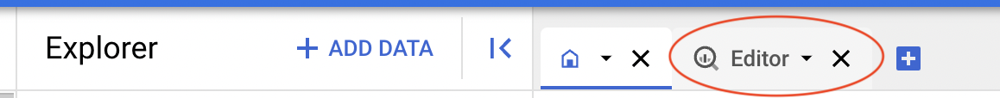

# SQL Translation from Redshift to BigQuery

## Overview

In this lab, you will program SQL SELECT, INSERT, UPDATE, and DELETE statements to create and return data in BigQuery. You will create Tables and Views using SQL DDL statements, and you will create custom behaviors using user-defined functions (UDFs) and stored procedures. 

## Objectives

In this lab, you learn how to:
* Alter data using SQL DML statements
* Query data using SQL SELECT statements
* Define tables and views using DDL statements
* Program custom behaviors using UDFs and Procedures
 

## Setup and Requirements

![[/fragments/start-qwiklab]]


![[/fragments/cloudshell]]


## Task 1. Creating the Pets database

1. In the Google Cloud Console, from the Navigation menu () select __BigQuery__. 


2. In the SQL Workspace toolbar, click on the Editor icon to open the SQL code editor.




3. Paste the following SQL code and click the __Run__ button to create a dataset named `ticket_sales`

```
CREATE SCHEMA IF NOT EXISTS animals_dataset OPTIONS( 
  location="us");
```

4. Create two tables: `owners` and `pets` by running the following SQL DDL statements, 

```
CREATE TABLE animals_dataset.Owners(
  OwnerID INT64 NOT NULL,
  Name STRING
  );

CREATE TABLE animals_dataset.Pets(
  PetID INT64 NOT NULL,
  OwnerID INT64 NOT NULL,
  Type STRING,
  Name STRING,
  Weight FLOAT64
  );
```

5. Expand the Explorer tree to verify the dataset and tables were created. 

6. Now, load some data into the tables. 

```
LOAD DATA INTO animals_dataset.Owners
FROM FILES (
  format = 'CSV', 
  field_delimiter = ',',
  uris = ['gs://bigquery-demo-bucket/animals-dataset/Owners.csv']);

LOAD DATA INTO animals_dataset.Pets
FROM FILES (
  format = 'CSV', 
  field_delimiter = ',',
  uris = ['gs://bigquery-demo-bucket/animals-dataset/Pets.csv']);
```

7. Now, run a couple queries as a test. Make sure both return results as you would expect. 

```
SELECT * FROM animals_dataset.Owners;
```

```
SELECT * FROM animals_dataset.Pets;
```

## Task 2. DML statements (INSERT, UPDATE, DELETE)

In SQL, DML stands for Data Manipulation Langauge. These are statements that are used to add, alter, and delete data from the database. They are used in BigQuery just like they are used in other databases. 

1. Run the following query to add the owner, Mary. 

```
INSERT INTO
  animals_dataset.Owners (OwnerID, Name)
VALUES
  (9, 'Mary');
```

2. Now, add Mary's two dogs.

```
INSERT INTO
  animals_dataset.Pets (PetID, OwnerID, Type, Name, Weight)
VALUES
  (28, 9, 'Dog', "George", 50);

INSERT INTO
  animals_dataset.Pets (PetID, OwnerID, Type, Name, Weight)
VALUES
  (29, 9, 'Dog', "Washington", 60);
```

3. Run the following query to make sure Mary and her dogs were added. 

```
SELECT
  o.Name, p.Type, p.Name
FROM
  animals_dataset.Owners o
JOIN
  animals_dataset.Pets p
ON
  o.OwnerID = p.OwnerID
WHERE 
  o.Name = 'Mary';
```

4. The boss decided that the type "Dogs" should be "Canines". Run the following UPDATE to fix that. 

```
UPDATE animals_dataset.Pets SET Type = 'Canine' WHERE Type = 'Dog';
```

5. Run a query to verify that all the Dogs are now Canines

6. The boss also decide that Frogs were not Pets. She said to delete all the Frogs from the Pets table. 

```
DELETE FROM animals_dataset.Pets WHERE Type = 'Frog';
```

7. Check the Query Results pane. One row should have been removed from the Pets table. 


## Task 3. SQL SELECT statements

SELECT statements in BigQuery are very similar as they are in other databases. As with many databases, there are relatively minor differences due the the platform. Let's take a look at some examples in this section. 

1. Use a JOIN to select all the Owners and their Pets.

```
SELECT
  o.Name, p.Type, p.Name, p.Weight
FROM
  animals_dataset.Owners o
JOIN
  animals_dataset.Pets p
ON
  o.OwnerID = p.OwnerID;
```

2. Add a WHERE clause to only select the Dogs. 

```
SELECT
  o.Name, p.Type, p.Name, p.Weight
FROM
  animals_dataset.Owners o
JOIN
  animals_dataset.Pets p
ON
  o.OwnerID = p.OwnerID
WHERE 
  p.Type = "Canine";
```

3. Now, sort by the Owner's name. 

```
SELECT
  o.Name, p.Type, p.Name, p.Weight
FROM
  animals_dataset.Owners o
JOIN
  animals_dataset.Pets p
ON
  o.OwnerID = p.OwnerID
WHERE 
  p.Type = "Canine"
ORDER BY
  o.Name ASC;
```

4. Let's count the pets by type using the following query. 

```
SELECT
  type,
  COUNT(*) AS count
FROM
  `animals_dataset.Pets`
GROUP BY
  type
ORDER BY
  count desc;
```

5. Now, let's count the pets by Owner. 

```
SELECT
  o.Name, count(p.Name) as count
FROM
  animals_dataset.Owners o
JOIN
  animals_dataset.Pets p
ON
  o.OwnerID = p.OwnerID
GROUP BY 
  o.Name
ORDER BY
  count DESC;
```

6. Now, return the pets as an array using the ARRAY_AGG and STRUCT functions. 

```
SELECT
  o.OwnerID,
  o.Name as OwnerName,
  ARRAY_AGG(STRUCT(
  p.Name as PetName,
  p.Type,
  p.Weight)) as Pets
FROM
  animals_dataset.Owners AS o
JOIN
  animals_dataset.Pets AS p
ON
  o.OwnerID = p.OwnerID
GROUP BY o.OwnerID, o.Name
```

7. You can use the WITH statement to query the results of another query. This avoids using nested SQL statements and makes the code easier to read. In the example below, we wrap the previous query with the WITH statement and then run a query just to get the pets array. 

```
WITH owners_pets as (SELECT
  o.OwnerID,
  o.Name as OwnerName,
  ARRAY_AGG(STRUCT(
  p.Name as PetName,
  p.Type,
  p.Weight)) as Pets
FROM
  animals_dataset.Owners AS o
JOIN
  animals_dataset.Pets AS p
ON
  o.OwnerID = p.OwnerID
GROUP BY o.OwnerID, o.Name)

SELECT pets from owners_pets;
```

6. Now, let's say you only want the owners and the names of their pets. Use a CROSS JOIN to join the owners with the array of pets, then just select the data you want to see.  

```
WITH owners_pets as (SELECT
  o.OwnerID,
  o.Name as OwnerName,
  ARRAY_AGG(STRUCT(
  p.Name as PetName,
  p.Type,
  p.Weight)) as Pets
FROM
  animals_dataset.Owners AS o
JOIN
  animals_dataset.Pets AS p
ON
  o.OwnerID = p.OwnerID
GROUP BY o.OwnerID, o.Name)

SELECT
  OwnerName, ARRAY_AGG(STRUCT(PetName)) as Pets from owners_pets 
CROSS JOIN
  UNNEST(Pets)
GROUP BY OwnerID, OwnerName;
```

7. Now, let's return just the names pets sorted. 

```
WITH owners_pets as (SELECT
  o.OwnerID,
  o.Name as OwnerName,
  ARRAY_AGG(STRUCT(
  p.Name as PetName,
  p.Type,
  p.Weight)) as Pets
FROM
  animals_dataset.Owners AS o
JOIN
  animals_dataset.Pets AS p
ON
  o.OwnerID = p.OwnerID
GROUP BY o.OwnerID, o.Name)

SELECT
  PetName from owners_pets 
CROSS JOIN
  UNNEST(Pets)
ORDER BY PetName;
```

8. Now, UNNEST the pets array and just get the big pets (those over 20 pounds). _The CROSS JOIN might be a little different than what you are used to, but it works._

```
WITH owners_pets as (SELECT
  o.OwnerID,
  o.Name as OwnerName,
  ARRAY_AGG(STRUCT(
  p.Name as PetName,
  p.Type,
  p.Weight)) as Pets
FROM
  animals_dataset.Owners AS o
JOIN
  animals_dataset.Pets AS p
ON
  o.OwnerID = p.OwnerID
GROUP BY o.OwnerID, o.Name)


SELECT
  OwnerID, OwnerName, ARRAY_AGG(STRUCT(PetName, Type, Weight)) as Pets from owners_pets 
CROSS JOIN
  UNNEST(Pets) AS pets where pets.weight > 20
GROUP BY OwnerID, OwnerName;
```

## Task 4. DDL statements

In SQL, DDL stands for Data Definition Language. Earlier in this lab, you used DDL statements to create the dataset and tables for the pets database. Now, you will see a few more examples where you will transform tables into other tables, and create views. 

1. Earlier you saw how to write a query to return nested-repeated data. Now, use a CREATE TABLE query write those results into a table. 

```
CREATE OR REPLACE TABLE
  animals_dataset.Owners_Pets AS (
  SELECT
    o.OwnerID,
    o.Name AS OwnerName,
    ARRAY_AGG(STRUCT( p.PetID,
        p.Name AS PetName,
        p.Type,
        p.Weight)) AS Pets
  FROM
    animals_dataset.Owners AS o
  JOIN
    animals_dataset.Pets AS p
  ON
    o.OwnerID = p.OwnerID
  GROUP BY
    o.OwnerID, o.Name);
```

2. In the Explorer pane, examine the schema of the newly created table. 

3. Earlier you wrote a query that joined the Owners and Pets tables to count the number of pets each owner has. This changes when the pets are in an array. Use the ARRAY_LENGTH function to return the number of pets for each owner.  

```
SELECT
  OwnerName,
  ARRAY_LENGTH(Pets) AS count
FROM
  `animals_dataset.Owners_Pets`
ORDER BY
  count DESC;
```

4. Use the code below to create a view that returns the small pets (those 20 pounds or less). After you run the query, examine the results in the Explorer pane. Run a query to verify the results are as expected. 

```
CREATE OR REPLACE VIEW
  animals_dataset.Small_Pets AS (
  SELECT
    *
  FROM
    animals_dataset.Pets
  WHERE
    weight <= 20);
```

5. A materialized view is recomputed periodically and the results are returned without having to re-run the query. Materialized views can be especially useful for queries that require complex processing like aggregations. Use the code below to create a materialized view, and then run a query to verify the results. 

```
CREATE OR REPLACE MATERIALIZED VIEW
  animals_dataset.pet_weight_by_type AS (
  SELECT
    type,
    SUM(Weight) AS total_weight
  FROM
    animals_dataset.Pets
  GROUP BY
    type
  );
```

## Task 5. UDFs and stored procedures 

User-defined functions can be used for any type of complex processing. Use a UDF when there is no built-in function that does what you need to do. <div>Stored procedures allow you to wrap one or more statements within a function. These statements can include both SELECT and DML statements like INSERT, UPDATE, and DELETE.</div>


1. Use the code below to create a user-defined function that converts pounds into kilos. 

```
CREATE OR REPLACE FUNCTION animals_dataset.PoundsToKilos(pounds FLOAT64)
AS (
  round(pounds / 2.2, 1)
);

```

2. Note in the Explorer pane, the UDF was saved in the dataset. Test it with the following query. 

```
SELECT name, weight as pounds, animals_dataset.PoundsToKilos(Weight) as Kilos
FROM animals_dataset.Pets;
```

3. We can make adding a new pet easier using a Stored Procedure. There is no built-in counter in BigQuery. So, the following procedure will find the largest ID in the Pets table, and add 1 to it, It will then use that value for the ID of a new Pet. Note, the use of the output variable. When the new pet is added the value of the new ID will be returned. 

```
CREATE OR REPLACE PROCEDURE animals_dataset.create_pet(
  customerID INT64,type STRING, name STRING, weight FLOAT64, out newPetID INT64)
BEGIN
SET newPetID = (SELECT MAX(PetID) + 1  FROM animals_dataset.Pets);

INSERT INTO animals_dataset.Pets (PetID, OwnerID, Type, Name, Weight)
  VALUES(newPetID, customerID, type, name, weight);
END
```

4. Test the procedure using the following code. After the code completes, take a look at the resutls of the SELECT statement in the All Results pane to see the new pet. Note, the output variable is passed as the last argument in the function call. 

```
DECLARE newPetID INT64;
CALL animals_dataset.create_pet(1, 'Dog', 'Duke', 15.0, newPetID);

SELECT * FROM animals_dataset.Pets WHERE PetID = newPetID;
```

5. Try adding a couple more pets. Notice, the ID field will keep incrementing. 


### **Congratulations!** You have programmed SQL SELECT, INSERT, UPDATE, and DELETE statements to create and return data in BigQuery. You created Tables and Views using DDL statements in SQL, and you created custom behaviors using user-defined functions and stored procedures. 


![[/fragments/endqwiklab]]

![[/fragments/copyright]]

